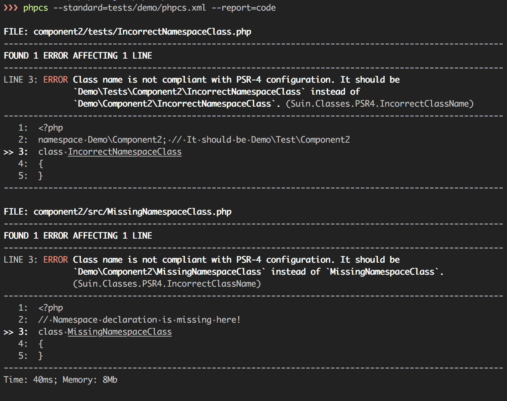

## Demo

```
phpcs --standard=tests/demo/phpcs.xml --report=code
```



## Contributing

Send [issue](https://github.com/suin/php/issues) or [pull-request](https://github.com/suin/php/pulls) to main repository.
